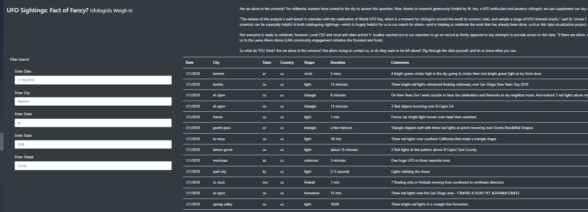
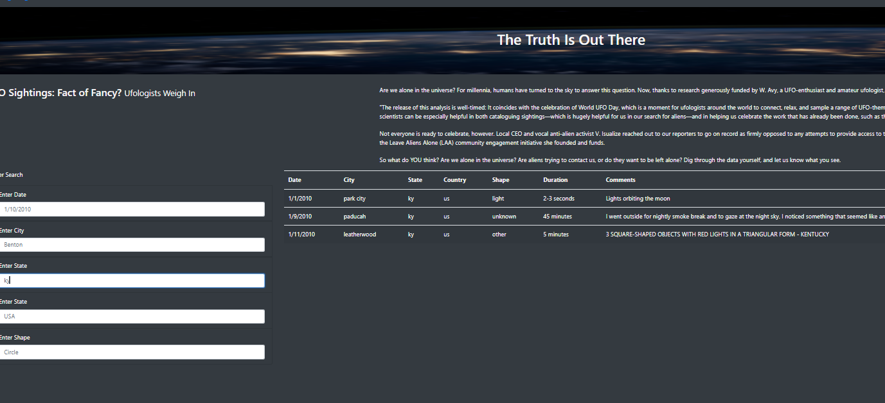

# UFOs
Using Javascript to update the UFO website

Overview of Project

Dana's(our clien) had approached us to build a website which would capture UFO sightings, a topic which is a topic very close to her heart.

The webpage and dynamic table we created are working as intended, but she’d like to provide a more in-depth analysis of UFO sightings by allowing users to
filter for multiple criteria at the same time. In addition to the date, she wanted us to add table filters for the city, state, country, and shape.

We would update our Javascript code and make the changes to the html and js files and get back to her.

We could also look at updating and refining the look of the website.

- Results 

Please refer to attached images to view vesbsite snapshots.

As you can see, the first image is how the website looks when you add no filter in any of the boxes to the left.

The second image is when you add just one filter in the "state" filter. 

You can add multiple filters across date, city, state, country and shape and customize your search vriteria.

- Summary

1 Drawback - The website looks a bit cluttered (too much info) and could confuse a user. The user maynot know that you can use multiple filters at the same time.

Recommendations

1- Images of the actual UFO sighting sites would be useful.

2- There is no information on the vaidity or source of the UFO information. There is no option to ask questions or get additional infor on any of the sightings.

